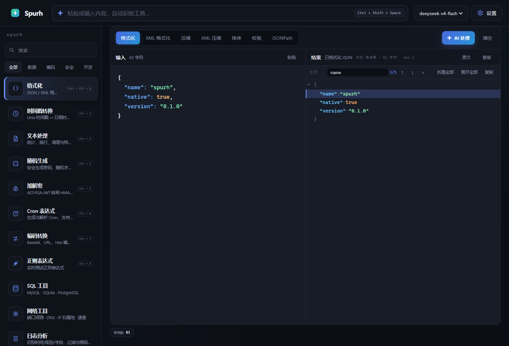
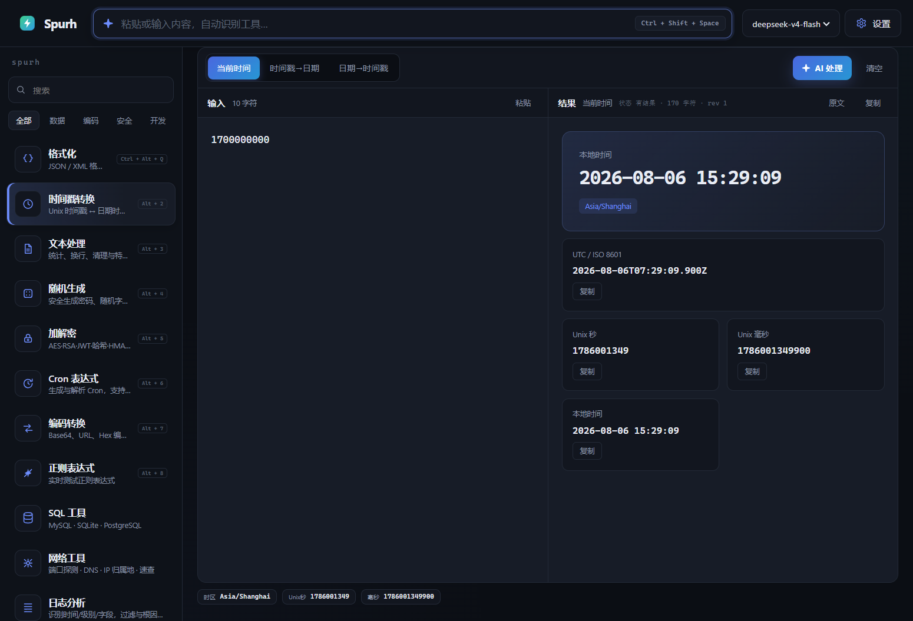
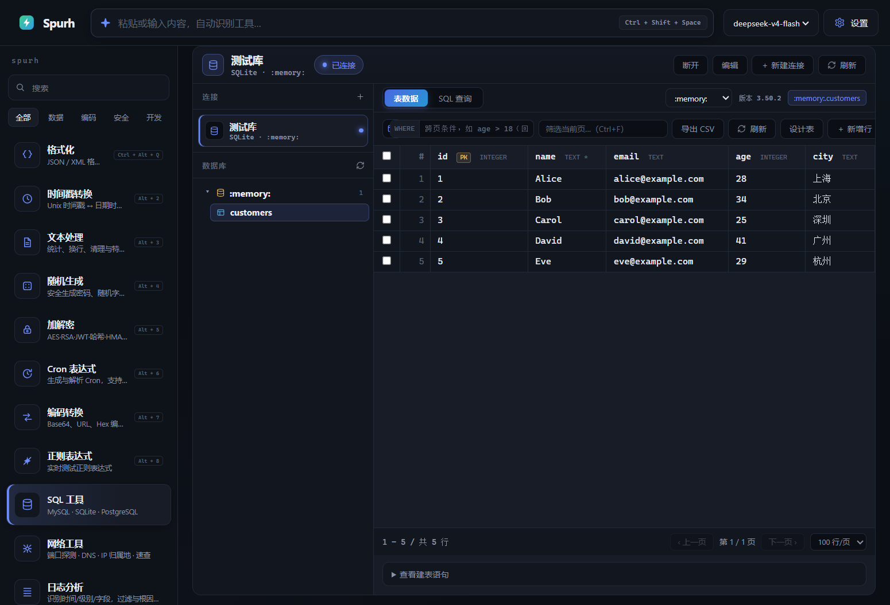
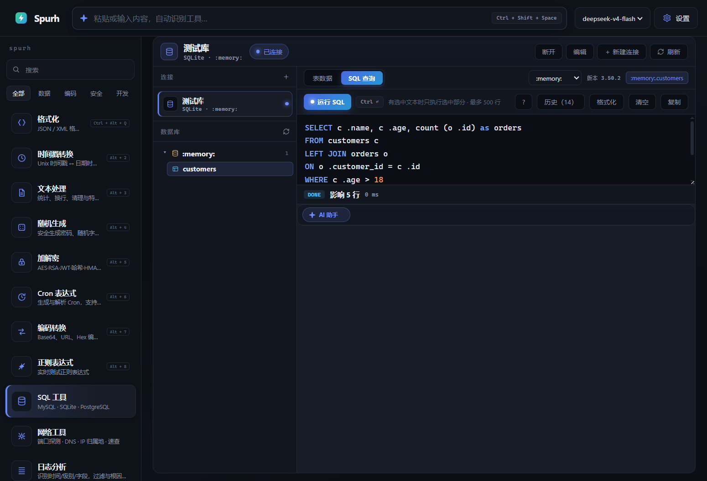
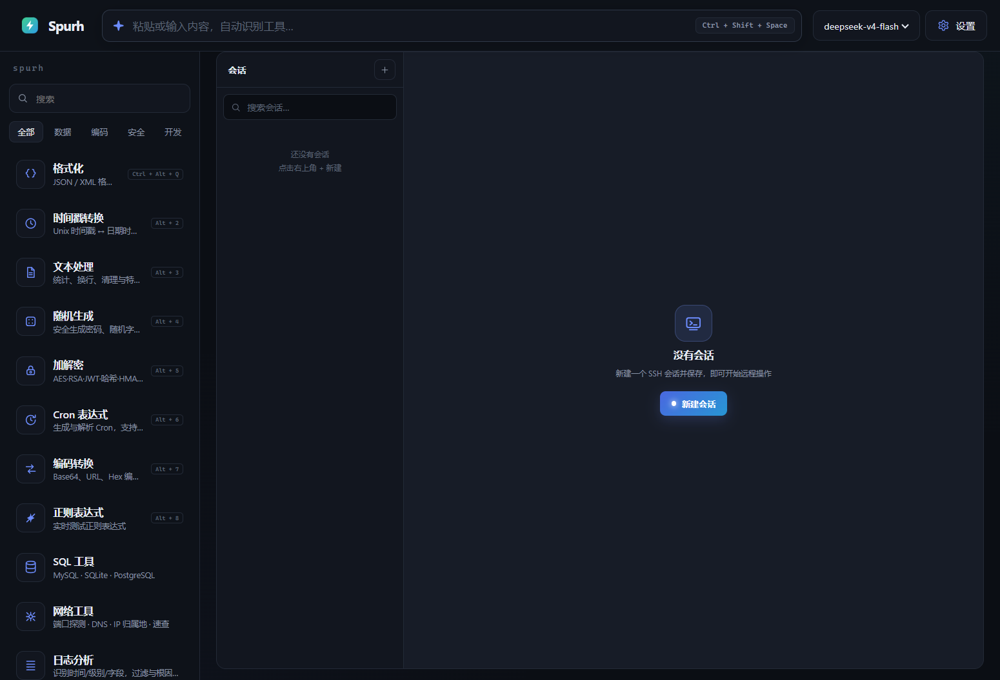
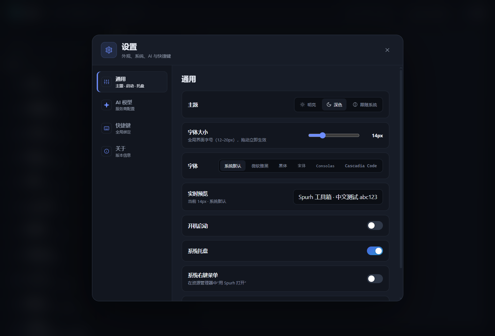
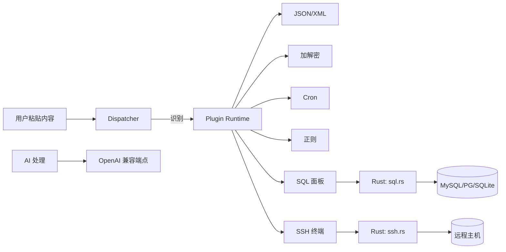

# ⚡ Spurh — AI Native Developer Toolbox

> 别找工具，直接粘贴。Spurh 自动识别你的内容，把结果放回你的指尖。

<p align="center">
  
</p>

<p align="center">
  
  
  
  
</p>

---

## 📑 目录

- [为什么是 Spurh](#-为什么是-spurh)
- [功能总览](#-功能总览)
- [界面截图](#-界面截图)
- [快速开始](#-快速开始)
- [插件开发](#-插件开发)
- [快捷键](#-快捷键)
- [架构](#-架构)
- [安全与隐私](#-安全与隐私)
- [常见问题](#-常见问题)
- [技术栈与目录结构](#-技术栈与目录结构)
- [License](#-license)

---

## ✨ 为什么是 Spurh

| 特性 | 说明 |
|---|---|
| 🧠 **智能 Dispatcher** | 粘贴即路由：JWT / JSON / Cron / 时间戳 / Base64 自动识别，置信度排序 + 手动覆盖 |
| 🔌 **插件优先** | 内置 13 个插件共用同一 `SpurhPlugin` 协议，第三方能力即插即用 |
| 🗄️ **数据库管理** | MySQL / PostgreSQL / SQLite：库表浏览、数据编辑、SQL 高亮/补全/格式化/历史、表设计器、CSV 导出 |
| 🖥️ **SSH 远程终端** | xterm.js 多标签终端、会话持久化、快捷命令、文件传输、主机资源监控 |
| 🤖 **AI 原生** | OpenAI 兼容流式接入（OpenAI / DeepSeek / Qwen / Gemini / Ollama 等），本地失败一键 AI 修复 |
| 🔒 **本地优先 · 安全** | 凭据存系统钥匙串，数据库连接支持 TLS，剪贴板监听可关闭 |
| 🎨 **极致体验** | 深色/浅色主题、全局快捷键、命令面板、剪贴板历史、零多余 UI |

---

## 🧰 功能总览

### 内置工具（13 个）

| 类别 | 工具 | 亮点 |
|---|---|---|
| 🧩 数据 | JSON / XML、文本处理 | 格式化、压缩、排序、JSONPath、树视图检索、统计/去重/大小写 |
| 🔤 编码 | Base64 / URL / Hex / Unicode / HTML | 双向转换、非法输入友好报错 |
| 🔐 安全 | AES / RSA / JWT / MD5 / SHA / HMAC | AES-256-GCM、JWT 编解码/验签/生成、本地计算不上传 |
| 🔎 开发 | 正则、Cron、随机、时间戳、日志 | 正则测试/替换/解释、Cron Quartz 扩展、安全随机、日志根因定位 |
| 🗄️ 数据库 | SQL 面板 | 三库客户端、数据网格编辑、WHERE 跨页筛选、SQL 补全/格式化/历史、表设计器、CSV 导出 |
| 🖥️ 远程 | SSH 面板 | 多标签终端、会话跨重启保持、快捷命令、文件传输、资源监控 |
| 🌐 网络 | 网络面板 | 端口扫描（并发受限）、DNS、TCP/UDP、路由追踪、IP 归属地 |
| 📋 剪贴板 | 剪贴板历史 | 搜索复用、图片支持、隐私开关、全局浮层 |

### 数据库面板（产品级）

- 连接：自动重连上次连接、快速连接卡片、SSL 加密、系统钥匙串存密码、连接池复用
- 数据：行号列、每页 50/100/200/500、当前页筛选（Ctrl+F）、**跨页 SQL 条件**（WHERE）、单元格右键复制、批量删除/新增/保存、CSV 导出
- SQL：语法高亮、**Ctrl+Space 补全**（关键字/表名/字段名）、格式化、历史（下拉 + Ctrl+↑/↓）、执行选中、F5、多语句脚本、查询结果分页、导出 CSV
- 表设计：建表/改表（增删改字段、主键、自增、注释）

### 远程面板（产品级）

- 仅活动标签建立连接，切换按需连接、旧标签不断开
- 会话搜索、标签页跨重启保持、连接错误重试
- 终端工具栏：字号 A± / 清屏 / 复制 / 粘贴；快捷键 Ctrl+L、Ctrl+Shift+C/V
- 快捷命令（磁盘/内存/uptime/ls/top 等一键发送）、文件上传下载（含大小提示）、主机资源信息

---

## 📸 界面截图

| | |
|---|---|
| 首页 · JSON 树视图与检索 |  |
| 智能 Dispatcher 识别 |  |
| SQL 表数据浏览 |  |
| SQL 编辑器（高亮/补全/格式化） |  |
| SSH 远程终端 |  |
| 设置面板 |  |

---

## 🚀 快速开始

### 环境要求

- **Node.js 20+**、**Rust 1.80+**
- 对应平台的 [Tauri 前置依赖](https://v2.tauri.app/start/prerequisites/)

### 安装与运行

```bash
# 安装依赖
npm install

# 浏览器模式（仅前端，部分系统能力不可用）
npm run dev

# 桌面应用（完整能力：托盘/全局快捷键/右键菜单/SSH/SQL/剪贴板）
npm run tauri dev
```

### 质量检查

```bash
npm run check      # svelte-check（0 错误 0 警告）
npm test           # vitest（73 个测试）
npm run build      # 前端生产构建
cargo clippy --manifest-path src-tauri/Cargo.toml --all-targets -- -D warnings   # Rust 静态检查
```

---

## 🔌 插件开发

插件通过 `SpurhPlugin` 协议接入：声明元信息、动作列表、同步检测器与可异步执行器。运行时负责隔离异常、限制执行时间并以统一结果结构交给 UI。

```ts
import type { SpurhPlugin } from './src/lib/plugins/types';
import { runtime } from './src/lib/plugins';

const plugin: SpurhPlugin = {
  id: 'acme.example',          // 小写字母开头，仅允许 a-z 0-9 . -
  name: 'Example',
  description: 'Example plugin',
  icon: 'EX',
  version: '0.1.0',
  category: '开发',
  actions: [{ id: 'run', label: '运行', description: '处理输入' }],
  options: [
    { id: 'mode', label: '模式', type: 'select', defaultValue: 'a',
      choices: [{ value: 'a', label: '模式 A' }, { value: 'b', label: '模式 B' }] },
  ],
  detect: (input) => input.startsWith('example:')
    ? { confidence: 0.9, reason: '检测到 example 前缀' }
    : null,
  execute: async (_action, input, options) => ({
    output: input.slice(8) + ' · ' + (options?.mode ?? 'a'),
    language: 'text',
    view: 'text',
    summary: '处理完成',
  }),
};

runtime.register(plugin);
```

- 协议：`src/lib/plugins/types.ts`
- 运行时：`src/lib/plugins/runtime.ts`（含超时与异常隔离）
- 内置插件：`src/lib/plugins/builtin/`

---

## ⌨️ 快捷键

| 快捷键 | 功能 |
|---|---|
| `Ctrl+Shift+Space` | 全局唤起 / 聚焦 Dispatcher |
| `Ctrl+K` | 命令面板 |
| `Ctrl+Shift+V` | 剪贴板历史浮层 |
| `Ctrl+Enter` / `F5`（SQL） | 执行 SQL（有选中只执行选中） |
| `Ctrl+Space`（SQL） | 关键字 / 表名 / 字段补全 |
| `Ctrl+F`（SQL） | 聚焦当前页筛选 |
| `Ctrl+S`（SQL） | 保存数据 / 表结构 |
| `Ctrl+↑` / `Ctrl+↓`（SQL） | 历史查询切换 |
| `Ctrl+L`（终端） | 清屏 |
| `Ctrl+Shift+C` / `Ctrl+Shift+V`（终端） | 复制 / 粘贴 |
| `Alt+1..8` | 快速切换工具 |
| `Esc` | 关闭浮层 / 菜单 / 补全 |

---

## 🏗️ 架构



- **前端**：Svelte 5（runes）+ TypeScript + Vite 8，重型面板按需懒加载（主 chunk ≈ 178KB）
- **后端**：Tauri 2（Rust），模块化 `sql` / `ssh` / `net` / `clipboard` / `secrets`
- **数据流**：前端 `invoke` → Rust 命令 → 结果经统一 `PluginResult` 结构渲染

---

## 🔒 安全与隐私

- **凭据**：API Key、数据库密码、SSH 密码/口令保存在**系统钥匙串**（Windows Credential Manager / macOS Keychain / Linux Secret Service），`localStorage` 只存非敏感配置，旧明文数据自动迁移
- **连接**：MySQL / PostgreSQL 支持 **TLS 加密**；SSH 采用 **TOFU**（首次连接记录主机指纹，后续不匹配拒绝连接）
- **AI**：仅在用户点击「AI 处理」时发送当前内容；支持自定义端点
- **剪贴板**：历史默认开启，可在设置中关闭；内容仅存内存
- **网络**：端口扫描并发受限（256）、查询超时可中断（SQLite interrupt）

---

## ❓ 常见问题

**Q: 为什么数据库面板切走后再进来不用重新连接？**
A: 面板会恢复上次使用的连接并自动重连；连接池复用让临时表/事务跨命令保持。

**Q: SSH 标签页重启应用后还在吗？**
A: 在。打开的标签与活动会话会持久化，启动后仅活动标签自动重连。

**Q: 凭据存在哪？安全吗？**
A: 系统钥匙串，由操作系统加密保护，不落盘明文到应用目录。

**Q: SQL 一次能执行多条语句吗？**
A: SQLite 支持多语句脚本（`execute_batch`）；MySQL/PG 建议逐条执行。

---

## 🏗️ 技术栈与目录结构

```
spurh/
├─ src/                  # 前端（Svelte 5）
│  ├─ lib/plugins/       # 插件协议与 13 个内置插件
│  ├─ lib/panels/        # SQL / SSH / 网络 / 日志 / 剪贴板 / Cron / Crypto / Regex
│  ├─ lib/components/    # 结果视图 / JSON 树
│  └─ App.svelte         # Dispatcher 与主界面
├─ src-tauri/            # Rust 后端（Tauri 2）
│  └─ src/               # sql / ssh / net / clipboard / secrets / lib
├─ screenshots/          # 界面截图（README 与官网共用）
├─ website/              # 独立官网首页（单 HTML）
└─ docs/DESIGN.md        # 产品与技术设计
```

## 📄 License

MIT © xuning
