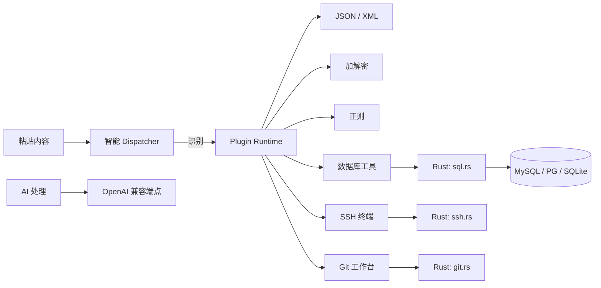

# ⚡ Spurh — AI 原生开发者工具箱

<div align="center">

**粘贴即识别 · 即输即转 · 全栈开发者的第二块屏幕**

一个把「找工具 → 粘贴 → 复制结果」压缩成一步的桌面工具箱。
JWT、JSON、Cron、时间戳、加解密、正则、数据库、SSH、Git……所有零碎活儿，一次输入全部搞定。

</div>

<p align="center">
  
  
  
  
</p>

<p align="center">
  
</p>

---

## 🚀 立即下载

| 平台 | 安装包 | 便携版 |
|---|---|---|
| **Windows** | [spurh-windows-x64.exe](https://github.com/gokeep-projects/spurh/releases/latest/download/spurh-windows-x64.exe) · [.msi](https://github.com/gokeep-projects/spurh/releases/latest/download/spurh-windows-x64.msi) | [spurh-windows-x64-portable.zip](https://github.com/gokeep-projects/spurh/releases/latest/download/spurh-windows-x64-portable.zip) |
| **macOS (Apple 芯片)** | [spurh-macos-arm.dmg](https://github.com/gokeep-projects/spurh/releases/latest/download/spurh-macos-arm.dmg) | — |
| **macOS (Intel)** | [spurh-macos-intel.dmg](https://github.com/gokeep-projects/spurh/releases/latest/download/spurh-macos-intel.dmg) | — |

> 全部安装包由 CI 自动构建发布，每次提交都会生成新的每日构建（nightly）。

---

## ✨ 为什么是 Spurh

| 能力 | 说明 |
|---|---|
| 🧠 **粘贴即路由** | 任意内容粘贴进顶部输入框，自动识别 JWT / JSON / Cron / 时间戳 / Base64 ……并路由到正确工具，无需选择 |
| 🤖 **AI 原生** | 每个工具都内置 AI 处理：本地失败一键修复、日志根因分析、SQL 错误解释、正则解释，接入任意 OpenAI 兼容端点 |
| 🗄️ **数据库工具** | MySQL / PostgreSQL / SQLite：连接管理、数据网格编辑、SQL 高亮补全、表设计器、**用户与权限设置**（Navicat 式） |
| 🖥️ **SSH 远程终端** | xterm.js 多标签终端、会话持久化、快捷命令、文件传输、资源监控 |
| 🔧 **Git 工作台** | SourceTree 式体验：文件变更 / 暂存 / 丢弃、分支管理、提交历史与差异、拉取推送；打开任意文件夹自动识别仓库 |
| 🌐 **网络工具** | 端口扫描、DNS、TCP/UDP 会话、链路追踪实时拓扑图（纯 Rust 实现） |
| 🎨 **四套主题** | 深色 / 明亮 / 极光 / 护眼，一键切换，明亮模式同样精心调校 |
| 🔒 **本地优先** | 凭据存系统钥匙串，全链路本地计算，剪贴板内容仅存内存 |

---

## 🧰 内置工具（14 个）

<div align="center">

| 类别 | 工具 |
|---|---|
| 🧩 数据 | JSON / XML 格式化 · 文本处理 · 时间戳转换 |
| 🔤 编码 | Base64 · URL · Hex · Unicode · HTML |
| 🔐 安全 | AES · RSA · JWT · MD5 · SHA · HMAC |
| 🔎 开发 | 正则表达式 · Cron · 随机生成 · 日志分析 |
| 🗄️ 数据 | 数据库工具 · Git 仓库 |
| 🌐 网络 | 端口探测 · DNS · 链路追踪 · TCP/UDP |
| 🖥️ 远程 | SSH 终端 · 剪贴板历史 |

</div>

### 亮点速览

- **数据库工具**：连接池复用、跨页 WHERE 筛选、Ctrl+Space 补全、CSV 导出、用户管理与权限设置
- **Git 工作台**：右键 / 拖入文件夹自动识别仓库；最近打开记录；暂存、丢弃、提交、分支切换、差异高亮
- **网络工具**：链路追踪实时拓扑图，TCP/UDP 会话可视化
- **日志分析**：自动识别时间 / 级别 / 字段，一键 AI 根因定位
- **聚焦框**：Ctrl+Shift+Space 随时唤起，输入即路由，支持全屏模式

---

## 📸 界面一览

| | |
|---|---|
| 首页 · 智能路由 |  |
| 智能 Dispatcher |  |
| 数据库表数据 |  |
| SQL 编辑器 |  |
| SSH 远程终端 |  |
| 设置面板 |  |

---

## 🚀 快速开始

### 环境要求

- **Node.js 20+** · **Rust 1.80+**
- 对应平台的 [Tauri 前置依赖](https://v2.tauri.app/start/prerequisites/)

### 本地运行

```bash
npm install

# 浏览器模式（部分系统能力如 SQL / SSH / Git 需要桌面环境）
npm run dev

# 桌面应用（完整能力）
npm run tauri dev
```

### 生产构建（独立可运行的 exe）

```bash
npm run build   # 前端产物 -> dist/
# 必须启用 custom-protocol，否则 release 版会回退加载 devUrl，无法独立运行
cargo build --release --features custom-protocol --manifest-path src-tauri/Cargo.toml
# 或直接用 Tauri CLI（自动处理 feature）
npm run tauri build
```

产物位于 `src-tauri/target/release/spurh.exe`。

### 质量保证

```bash
npm run check     # 类型检查：0 错误 0 警告
npm test          # 前端测试：212 个用例
npm run build     # 前端生产构建
cargo test --manifest-path src-tauri/Cargo.toml --lib   # Rust 测试：27 个用例
cargo clippy --manifest-path src-tauri/Cargo.toml --all-targets -- -D warnings
```

---

## ⌨️ 快捷键

| 快捷键 | 功能 |
|---|---|
| `Ctrl+Shift+Space` | 全局唤起 / 聚焦 Dispatcher |
| `Ctrl+K` | 命令面板 |
| `Ctrl+Shift+V` | 剪贴板历史浮层 |
| `Alt+1..9` | 快速切换工具 |
| `Ctrl+Enter` / `F5`（SQL） | 执行 SQL |
| `Ctrl+Space`（SQL） | SQL 补全 |
| `Ctrl+L`（终端） | 清屏 |
| `Esc` | 关闭浮层 / 菜单 / 补全 |

---

## 🏗️ 架构



- **前端**：Svelte 5（runes）+ TypeScript + Vite，面板按需懒加载，首屏 < 100KB gzip
- **后端**：Tauri 2（Rust），模块化 `sql` / `ssh` / `net` / `git` / `clipboard` / `secrets`
- **数据流**：前端 `invoke` → Rust 命令 → 统一 `PluginResult` 渲染

---

## 🔌 插件开发

插件通过 `SpurhPlugin` 协议接入：声明元信息、动作列表、同步检测器与可异步执行器。运行时负责隔离异常、限制执行时间并以统一结果结构交给 UI。

```ts
import type { SpurhPlugin } from './src/lib/plugins/types';
import { runtime } from './src/lib/plugins';

const plugin: SpurhPlugin = {
  id: 'acme.example',
  name: 'Example',
  description: 'Example plugin',
  icon: 'EX',
  version: '0.1.0',
  category: '开发',
  actions: [{ id: 'run', label: '运行', description: '处理输入' }],
  detect: (input) => input.startsWith('example:')
    ? { confidence: 0.9, reason: '检测到 example 前缀' }
    : null,
  execute: async (_action, input, options) => ({
    output: input.slice(8) + ' · ' + (options?.mode ?? 'a'),
    language: 'text',
    view: 'text',
    summary: '处理完成',
  }),
};

runtime.register(plugin);
```

- 协议：`src/lib/plugins/types.ts`
- 运行时：`src/lib/plugins/runtime.ts`（含超时与异常隔离）
- 内置插件：`src/lib/plugins/builtin/`

---

## 🔒 安全与隐私

- **凭据**：API Key、数据库密码、SSH 口令保存在**系统钥匙串**（Windows Credential Manager / macOS Keychain / Linux Secret Service）
- **连接**：MySQL / PostgreSQL 支持 TLS；SSH 采用 TOFU 指纹校验
- **AI**：仅在点击「AI 处理」时发送当前内容，支持自定义端点
- **剪贴板**：历史默认关闭监听，内容仅存内存
- **网络**：端口扫描并发受限，查询可中断

---

## 📄 License

MIT © xuning
